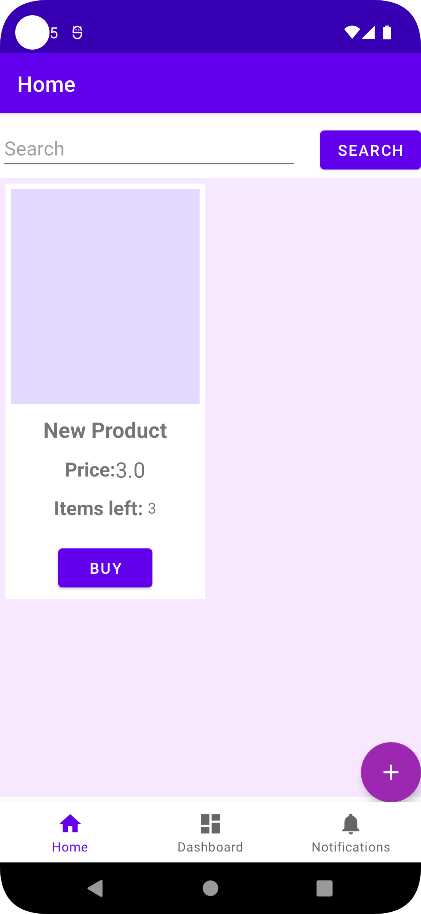
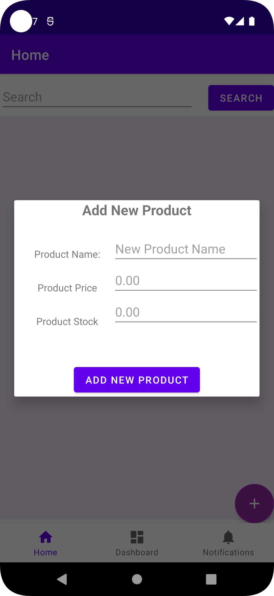
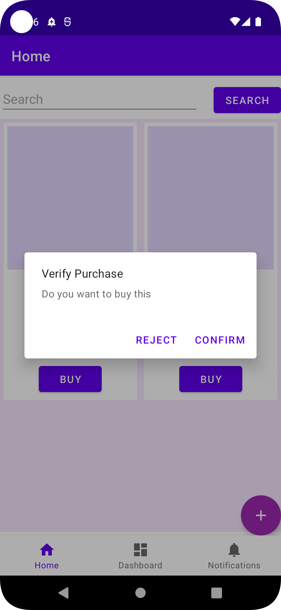
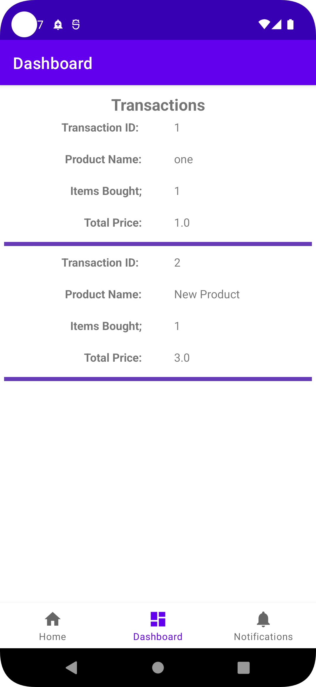
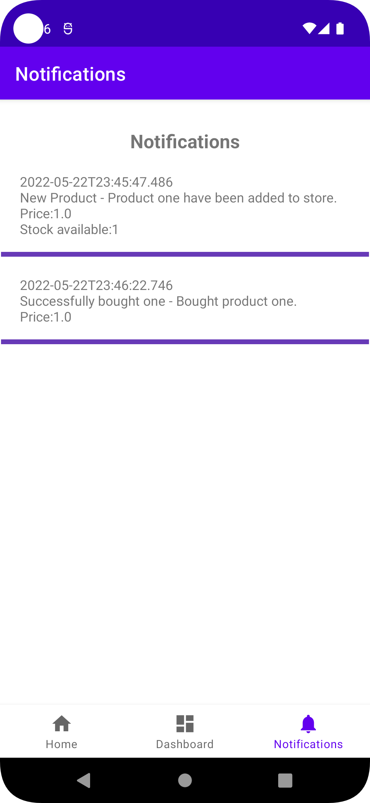

# Android Ecommerce App

Android project for learning/switching from Java to Kotlin

### Things this project try to demonstrate
- basic understanding of Kotlin
- using MVVM for Android project
- using the Material library
- working with XML layouts
- working with Activities & Fragments
- working with Material Dialog builder
- creating custom DialogFragment
- working with Navigation component
- working with RecyclerView
- working with ViewModel
- working with Room database and basic SQL queries
- working with JSON files using kotlinx functions
- saving and loading files from internal storage
- displaying Notifications

##Screenshots
 

